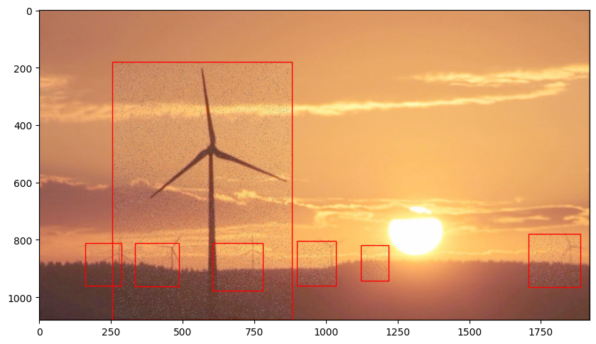
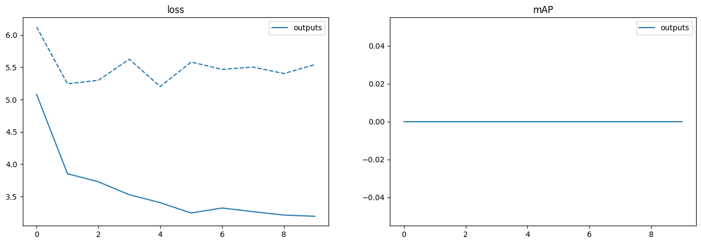
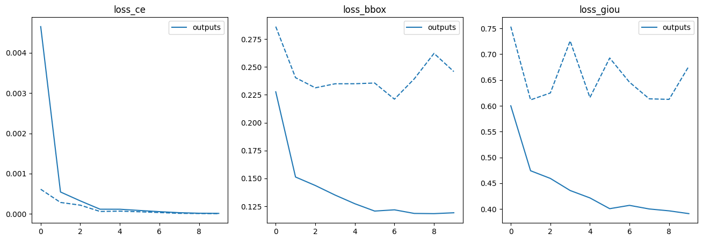
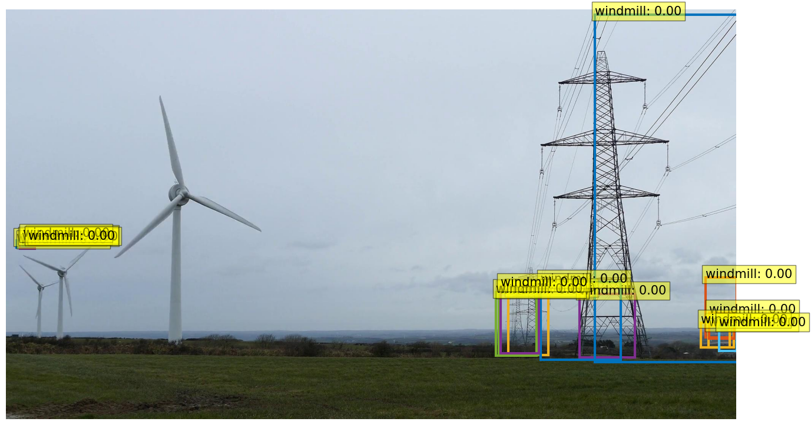

# Windmill Object Detection w/ DETR

## Overview
This is an end-to-end object detection with transformers project meant to fine tune a foundational object detection model for identifying windmills in images by DB Christenson. I worked on this project on my own.

There are two notebooks in this repo: the local machine and the google colab compatible notebook that is tagged with 'colab' in the file name.

## Methodology
I used the DETR model from Meta to fine tune a model to identify windmills in images. The model was initially trained on the COCO dataset and then I finetuned it on a dataset of windmill images retrieved from [kaggle](https://www.kaggle.com/datasets/kylegraupe/wind-turbine-image-dataset-for-computer-vision?resource=download).

#### Dataset Preparation
The windmill dataset was not in the correct format upon download. I built a custom converter to format the YOLO data into the COCO format. In the local machine version of the notebook.

In the colab notebook, I had to rearrange the data so that it was in the correct format for finetuning the model. I also needed to create my own bounding box visualization functions as the ones provided by DETR were not compatible with the windmill dataset.

Example training image from windmill dataset 

## Results
Results were not very satisfying. Although loss generally trended downwards, the model seemed unable to capture and learn the windmill objects. Softmax predictions for bounding boxes were extremely low, generally in the `3e-6` range and, consequently, not very accurate in terms of location.

For all graphs, solid lines are training results and dashed lines are validation results.

#### mAP

#### Loss

#### Prediction Example

As you can see, on the training set the loss is consistently decreasing, which is expected. However, on the validation set the results are less promising with the loss not decreasing as much as expected and also bouncing around.

The predictions example shows that the model may actually be seeing electrical towers as windmills while it is unable to properly bound the actual windmills of a similar size in the image.

## Challenges
Because colab has GPU usage limitations, I was only able to run a limited amount of experiments on the model. Additionally, my local machine was not compatible with CUDA so I was unable to run more experiments there. This resulted in unoptimal model. I conceptually followed a similar project that created an end-to-end detector with a dataset of balloons. This dataset was much smaller than the windmill dataset but performed much better with the same parameters given to DETR. If I had more resources to run experiments, I would have tried to use `n < 50` samples to finetune as it may have provided better results.

Another challenge that came with colab was the inability to modify the source code of DETR. I was using a branch of DETR that was made for finetuning, but there were many hard coded paths that were difficult to change in the colab environment. This caused me to have to mess with the paths for the training, validation, and testing data.

